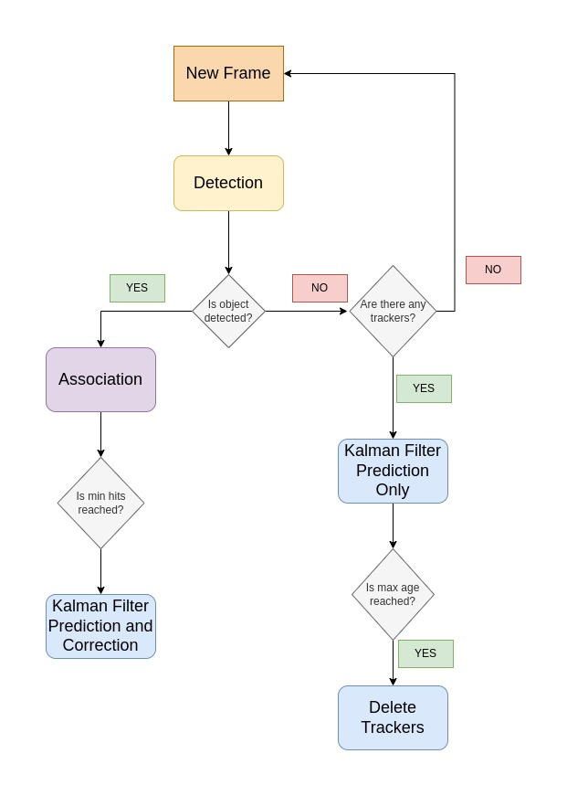

# Real-Time Object Detection and Tracking with SORT Algorithm, Kalman Filter and TensorRT

In this repository, a COCO pre-trained YOLOX-x model is finetuned on BDD100K dataset. You can fine-tune any model that can be converted to tensorrt using the mmdetection-to-tensorrt repository. You can find a detailed expalanation about how to fine-tune an mmdetection model on a custom dataset in my medium blogpost:

[Real-Time Object Detection And Tracking With TensorRT, Kalman Filter, and SORT Algorithm: Part 1 Training the Model](https://medium.com/@taylan.ates417311/real-time-object-detection-and-tracking-with-tensorrt-kalman-filter-and-sort-algorithm-part-1-a353143187aa)

The resulting video:

[](https://www.youtube.com/watch?v=_3Grxz8vKVs)


## Project Structure
```bash

detection_and_tracking/
├── README.md
├── configs /
│   ├── _base_/
│   │    ├── schedules /
│   │    │   └──schedule_1x.py
│   │    └──default_runtime.py
│   ├── yolox_s_8x8_300e_coco.py
│   └── yolox_x_8x8_300e_coco.py
├── docker/
│   └── Dockerfile
├──tests /
│   ├── test_process.py
│   ├── test_tracker.py
│   └── test_utils.py
├── LICENSE
├── convert_tensorrt.py
├── detector.py
├── inference.py
├── inference.yaml
├── process.py
├── tracker.py
└── utils.py
```

## Getting Started
To get started, follow these steps:

1- Clone this repository to your local machine.

```
git clone https://github.com/taylanates24/detection_and_tracking.git
```
2 - Build a docker image and create a container from docker image  (recommended)

```
docker build -t track:v1 -f docker/Dockerfile .
```

```
docker run -v $(pwd):/workspace -it --rm --ipc host track:v1
```

3 - Download my trained YOLOX-x model on BDD100K dataset (32.7 box-AP) in the following link:

[YOLOX-x 32.7 box-AP](https://drive.google.com/file/d/1_7Uu-Z1CWztFx4oymd6gypXsmJQemnN8/view?usp=share_link)

4 - Download the input video in the following link:

[tokyo.mp4](https://drive.google.com/file/d/14MHmg6zaMcg3eqfgvhjzrYSWGczjMwIN/view?usp=share_link)

5 - Convert the trained mmdetection model to TensorRT:

```
python3 convert_tensorrt.py --config configs/yolox_x_8x8_300e_coco.py --checkpoint /path/to/checkpoint_file --save_path /save/path --device 'cuda:0' --fp16 True

```

6 - Modify the configuration file inference.yaml to match your hyperparameters and input paths.


7 - Start inference by running the following code :

```
python3 inference.py --infer_cfg inference.yaml
```

## The Algorithm

When writing this repository, I used the following papers:

1) [Optimized Object Tracking Technique Using Kalman Filter](https://arxiv.org/abs/2103.05467)

2) [Simple Online and Realtime Tracking](https://arxiv.org/abs/1602.00763)

The overall algorithm is as follows:



In this flowchart:
    
`Association` is the Hungarian algorithm which matches detectors and trackers using an intersection over union (IOU) matrix.

`Detection` is a TensorRT module of YOLOX-x model.

`min_hits` is the number of consecutive frames where an object appears. After min_hits, a tracker is created for that object. The aim is the minimization of false positives. It can be changed in `inference.yaml` file.

`max_age` is the number of consecutive frames that a tracked object cannot be detected. That means the object may go out of frame. After `max_age`, the tracker is deleted.

If you want a more detailed explanation of Kalman Filter, TensorRT, SORT algorithm, Hungarian algorithm and how to fine-tune an mmdetection model on BDD100K dataset, you can read my blog posts on Medium. You can find example codes and reading lists as well.

1) [Real-Time Object Detection And Tracking With TensorRT, Kalman Filter, and SORT Algorithm: Part 1 Training the Model](https://medium.com/@taylan.ates417311/real-time-object-detection-and-tracking-with-tensorrt-kalman-filter-and-sort-algorithm-part-1-a353143187aa)

2) [Real-Time Object Detection And Tracking With TensorRT, Kalman Filter, and SORT Algorithm: Part 2 Converting The Model to TensorRT and Inference](https://medium.com/@taylan.ates417311/real-time-object-detection-and-tracking-with-tensorrt-kalman-filter-and-sort-algorithm-part-2-b3c02379d38a)

3) [Real-Time Object Detection And Tracking With TensorRT, Kalman Filter, and SORT Algorithm: Part 3 Kalman Filter and SORT Algorithm](https://medium.com/@taylan.ates417311/real-time-object-detection-and-tracking-with-tensorrt-kalman-filter-and-sort-algorithm-part-3-433d810ebc44)
